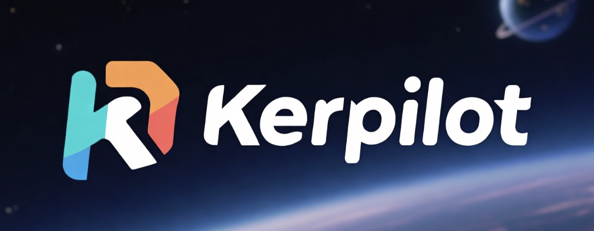

<p align="center">
  
</p>

# Kerpilot

A Kerbal Space Program mod that provides an in-game AI chat assistant powered by any OpenAI-compatible LLM API.

## Features

- Modern dark-themed chat interface with rounded message bubbles
- LLM integration with streaming responses (token-by-token display)
- **Game-aware tools** — the AI can query live game data via function calling:
  - Vessel part composition (names, counts, masses, resources)
  - Vessel delta-v budget per stage (delta-v, TWR, ISP, burn time)
  - Vessel orbit parameters (Ap/Pe, inclination, eccentricity, period)
  - Vessel flight status (altitude, speed, G-force, electric charge, CommNet)
  - Part details (description, cost, mass, category, resource capacities)
  - Celestial body parameters (gravity, atmosphere, SOI, orbital data)
  - Atmosphere profiles (pressure, temperature, density at multiple altitudes)
  - Active and offered contracts (objectives, rewards, completion state)
  - Available parts search (filtered by tech tree progress in Career/Science mode)
- **Context-aware skills** — automatically injects relevant domain knowledge into the AI based on your question:
  - Orbital Mechanics: Hohmann transfers, gravity turns, inclination changes, rendezvous, aerobraking
  - Rocket Design: staging, TWR guidelines, Tsiolkovsky equation, aerodynamic stability, engine selection
  - Delta-v Budget: complete KSP delta-v map data, mission budgets, safety margins
  - Contracts Guide: contract types (science gathering, part testing, rescue, satellite, survey, tourism), parameter requirements, completion tips
- Settings panel to configure API endpoint, API key, and model
- Supports any OpenAI-compatible API (OpenAI, Anthropic via proxy, local models, etc.)
- Toolbar button and `Ctrl+K` keyboard shortcut to toggle the window
- `Ctrl+C` to interrupt an in-progress AI response
- Press `Up` arrow in an empty input field to recall your last message
- Type `clear` in the chat to reset conversation history
- Draggable window
- Input lock prevents chat keystrokes from triggering vessel controls
- Available in Space Center, Flight, Map View, and VAB/SPH scenes (vessel tools work in both flight and editor)

## Limitations

Kerpilot is an AI chat assistant that provides information and guidance — it does **not** directly control the game. The following features are out of scope:

- **Rocket autopilot / flight control** — Kerpilot cannot execute maneuvers, hold attitude, or fly your vessel. For automated flight control, use [MechJeb2](https://github.com/MuMech/MechJeb2).
- **Rocket assembly** — Kerpilot cannot place or modify parts in the VAB/SPH. It can advise on rocket design, but you build it yourself.
- **Contract activation** — Kerpilot cannot accept or decline contracts. It can show you available contracts and explain their requirements.

## Requirements

- KSP 1.12.5
- [.NET SDK](https://dotnet.microsoft.com/download) (6.0+)
- [Mono](https://www.mono-project.com/download/stable/) (for net472 reference assemblies)

## Build

1. Clone the repository:

   ```bash
   git clone https://github.com/your-username/Kerpilot.git
   cd Kerpilot
   ```

2. If your KSP is not at the default Steam location, set the `KSPROOT` environment variable or pass `-p:KSPRoot=...`:

   ```bash
   export KSPROOT="/path/to/Kerbal Space Program"
   ```

3. Build:

   ```bash
   dotnet build -c Release
   ```

   The compiled DLL is automatically copied to `GameData/Kerpilot/Plugins/`.

## Install

**From release zip:** Download the latest `Kerpilot-vX.Y.Z.zip` from [Releases](https://github.com/your-username/Kerpilot/releases), extract it into your KSP `GameData/` directory so the structure is `GameData/Kerpilot/Plugins/Kerpilot.dll` and `GameData/Kerpilot/Skills/*.md`.

**For development:** Symlink the `GameData/Kerpilot` folder into your KSP `GameData` directory:

```bash
ln -s "$(pwd)/GameData/Kerpilot" "/path/to/Kerbal Space Program/GameData/Kerpilot"
```

## Package

Build a distributable zip for release:

```bash
dotnet msbuild Kerpilot.csproj -t:Package -p:Configuration=Release
```

Output: `dist/Kerpilot-vX.Y.Z.zip` — users extract this into their KSP `GameData/` folder.

## Usage

1. Launch KSP and enter Space Center or Flight
2. Click the **K** toolbar button or press **Ctrl+K** to open the chat window
3. Click the **gear icon** (⚙) in the header to open Settings
4. Enter your API endpoint (default: `https://api.openai.com/v1`), API key, and model name
5. Click **Save**, then **Back** to return to chat
6. Type a message and press **Send** or **Enter** — the AI will respond with streamed tokens

## Tests

The project includes a test suite that verifies tool availability, dispatch routing, JSON parsing, request body construction, and skill selection — all without requiring a running KSP instance.

Run the tests:

```bash
dotnet test tests/Kerpilot.Tests.csproj -c Release
```

## Contribute

1. Fork the repository and create a feature branch from `main`
2. Make sure your KSP install is set up for building (see [Build](#build))
3. Make your changes and verify the build passes:
   ```bash
   dotnet build -c Release
   ```
4. Run the test suite:
   ```bash
   dotnet test tests/Kerpilot.Tests.csproj -c Release
   ```
5. Test in-game with KSP 1.12.5
6. Open a pull request against `main`

### Guidelines

- All UI is built programmatically with uGUI — no asset bundles or IMGUI
- Follow the terminal-style interface pattern (single rich-text log, `<color>` tags, `FormatLine()`)
- New tools go in `src/Tools/` — add a JSON schema in `ToolDefinitions.cs` and implement in `GameDataTools.cs`
- New skills: add a `.md` file to `GameData/Kerpilot/Skills/` with frontmatter (`id`, `title`, `keywords`) — loaded automatically at runtime
- Add tests for new tools or skills in the `tests/` project
- Keep the mod lightweight — no external dependencies beyond KSP/Unity assemblies

## License

[GPL-3.0](LICENSE)
